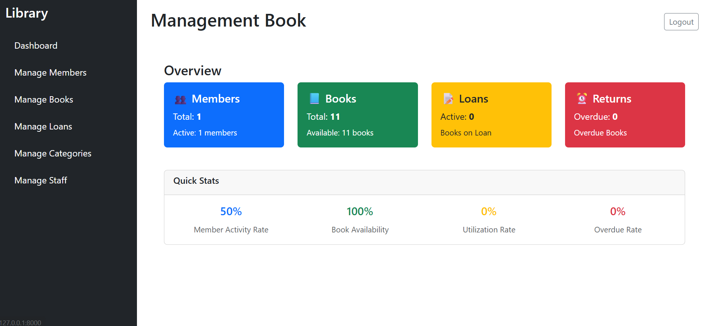

# 📚 Management Library

## 📌 Brief Description

**Management Library** is a web-based application designed to assist in the integrated management of libraries. This application includes the management of book data, members, and borrowing/return transactions, making it more efficient and organized.

**Purpose:**
- Facilitating the recording and tracking of books.
- Automating the borrowing and returning processes.
- Increasing the work efficiency of librarians.

**Main User:**
- **Librarian/Admin** → Managing book, member, and transaction data.
- **Library Member** → Check the availability of books and the status of borrowing.

## 🚀 Main Features

- ✅ **User Authentication**
  - 🔑 Login
  - 🚪 Logout

- 👥 **User Management**
  - ✏️ Manage user data (admin/librarian).

- 🧾 **Library Membership Management**
  - ➕ Add new member.
  - 📋 View & edit member data.
  - ❌ Remove member.

- 🗂 **Category Management of Books**
  - ➕ Add book category.
  - ✏️ Edit category.
  - ❌ Delete category.

- 📚 **Book Management**
  - ➕ Add a new book.
  - ✏️ Edit book information.
  - ❌ Delete the book.
  - 📦 Check the book stock.

- 🔄 **Loan & Return Management**
  - ➕ The book borrowing process.
  - 🔄 Book return process.
  - 📊 View borrowing history.

- 🏠 **Home Dashboard**
  - 📈 Displaying a summary of book data, members, and transactions.



## 🛠 Installation

### 1️. Clone Repository
```bash
git clone git@github.com:BramaAntoro/management-library.git
```
### 2. Open the folder
``` bash
cd management-library
```

### 3. Installation Dependency Laravel
```bash
composer install
```

### 4. Environment Configuration
```bash
cp .env.example .env
php artisan key:generate
```
- Set up the database configuration in the .env file (such as DB_DATABASE etc.)
- Make sure MySQL is running.

Run the migration & seeder (to create the default admin account)
```bash
php artisan migrate --seed --class=UserSeeder
```

run the server laravel
``` bash
php artisan serve
```

# Management Library

## 📖 How to Use

Here are the simple steps to use the **Management Library** application:

### 1️. Login
- Open your browser and access the application
- Enter your admin or librarian account email and password
- Click the **Login** button.

### 2️. Data Management
- After login, you will be directed to the **Dashboard** which displays a summary of books, members, and transaction data.
- Use the navigation menu to manage:
  - **Manage members**: Add, view, edit, or delete library members.
  - **Manage books**: Add new books, edit details, check stock, or delete books.
  - **Manage categories**: Add, edit, or delete book categories.
  - **Manage loans**: Process book borrowing and returning transactions.
  - **Manage staff**: Add, edit, or delete admin/librarian data.

### 3️, Borrowing & Returning Process
- In the **Manage loans** menu, click add, select the member and book to be borrowed.
- Input the borrowing date and return deadline.
- Save the transaction.
- For returns, search for the active transaction and click update, change the status and Actual Return Date.

### 4️. Logout
- Click the **Logout** button to exit the application.

## 🧩 Tech Stack / Technologies Used

- **PHP** – Main programming language for back-end.
- **Laravel** – PHP framework used to build the application.
- **Livewire** – Laravel library for building interactive interfaces without much JavaScript.
- **MySQL** – Relational database management system for application data storage.

## 👤 Contact & Credits

**Created by:**  
Brama Antoro  
📧 Email: brama4751antoro@gmail.com  
📷 Instagram: [@bramaantoro](https://www.instagram.com/bramaantoro/)  
💼 LinkedIn: [Brama Antoro](https://www.linkedin.com/in/brama-antoro-11b11a29a/)